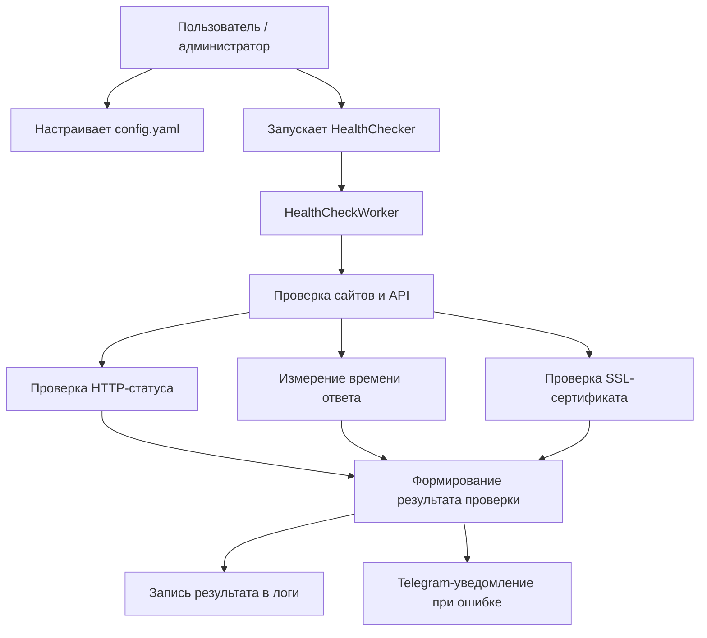
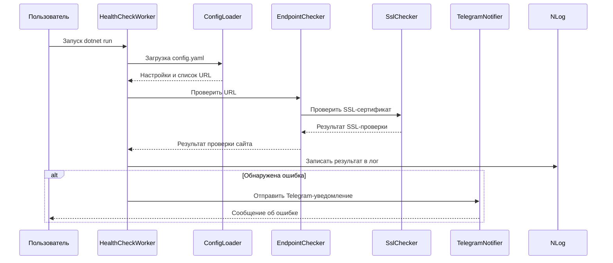

# Отчет по Контрольной точке №1: Проектирование и Старт

## Название проекта

**HealthChecker: сервис распределенного мониторинга API**

## Команда / разработчик

**Саширин Матвей** — соло-разработчик, Backend/DevOps-разработчик.

---

## 1. Архитектурный план и концепция

### Цель сервиса

**HealthChecker** — это микросервис для мониторинга доступности сайтов и API.

Сервис по расписанию проверяет URL-адреса из файла `config.yaml`, анализирует HTTP-статус, время ответа и состояние SSL-сертификата.

При обнаружении ошибки, таймаута, неожиданного HTTP-статуса или проблемы с SSL сервис записывает событие в лог и отправляет уведомление в Telegram.

### Целевой интерфейс

Фоновый сервис с консольным запуском через команду:

```powershell
dotnet run
```

### Выбранный стек технологий

- **Язык программирования:** C# .NET 8
- **Тип приложения:** .NET Worker Service
- **HTTP-клиент:** HttpClient
- **Конфигурация:** YamlDotNet, `config.yaml`
- **Уведомления:** Telegram.Bot
- **Логирование:** NLog
- **Статический анализ:** StyleCop Analyzers
- **Контейнеризация:** Docker, Docker Compose

---

## 2. Проектирование

### Диаграмма вариантов использования



### Диаграмма последовательности взаимодействия модулей



---

## 3. Распределение ролей

| Участник | Роль | Зона ответственности |
|---|---|---|
| Саширин Матвей | Соло-разработчик / Backend/DevOps-разработчик | Проектирование архитектуры, разработка микросервиса, настройка конфигурации, реализация проверки URL-адресов, HTTP-статусов, времени ответа, SSL-сертификатов, логирования и Telegram-уведомлений |

---

## 4. Чек-лист готовности

- [x] Создан новый GitHub-репозиторий проекта.
- [x] Оформлен стартовый `README.md`.
- [x] В `README.md` добавлено описание утилиты.
- [x] В `README.md` указан выбранный стек технологий.
- [x] В `README.md` указан участник и его роль.
- [x] Создана базовая структура проекта.
- [x] Проект реализован на C# .NET 8.
- [x] Настроен запуск через `dotnet run`.
- [x] Проект успешно собирается через `dotnet build`.
- [x] Добавлен конфигурационный файл `config.yaml`.
- [x] Реализована проверка URL-адресов.
- [x] Реализована проверка HTTP-статуса.
- [x] Реализовано измерение времени ответа.
- [x] Реализована проверка SSL-сертификата.
- [x] Настроено логирование через NLog.
- [x] Реализована отправка уведомлений в Telegram.
- [x] Добавлены `Dockerfile` и `docker-compose.yml`.
